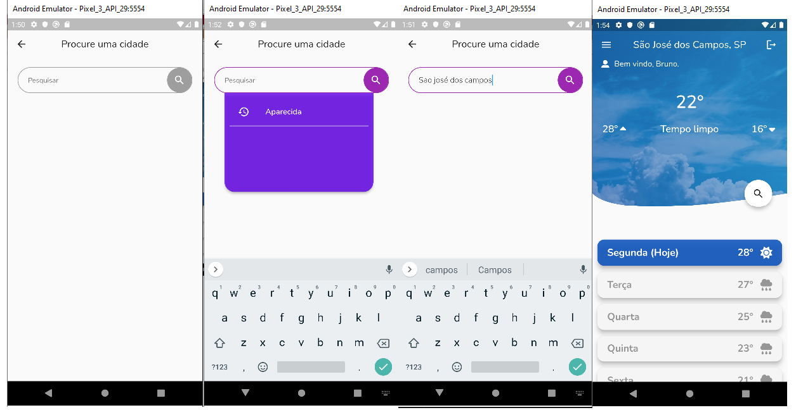

## Objectives
This app is a **remaster**, but I previously created a __website__ and this one is for __android__, one of the goals is to recreate the concept of weather app, but with more knowledge.

I didn't recreate the web version, because I wanted to learn another architecture (V.I.P.E.R)

## Used technologies

 - Animate_do -> (some animations)
 - mobx -> State Managements
 - crypto -> encrypted user password
 - hive -> local storage
 - location -> user actual location
 - http -> API call
 - shared_preferences -> Persist data
 - V.I.P.E.R Architecture

## Difficulties
Using the V.I.P.E.R architecture was a good challenge, not because of its folders (since it is familiar with MVVM) but because it is not the best pair with reactive programming like mobx. But it can adapt very well when creating a ViewModel for your connections

## App Images
 :warning: **IMPORTANT**: when creating the app I created several animations, now
unfortunately my computer is getting old and I can't record anymore, so I decided to take some prints.
__personally i dont like print's__ but it's all i have for now

## What you need to run the project
 First of all, you need the Flutter(of course) and when you clone the repo of the app, you need to create a .env file and add a PRIVATE_KEY and API_KEY, where:
  - **API_KEY** is API from [HG Brasil](https://hgbrasil.com/) 
  - **PRIVATE_KEY** is a random String combination, initially done by numbers, it is a means of security that aims to add values to the SHA-256 hash in the user's password

After these steps run in your terminal from Visual Studio Code this command: <code>dart run build_runner build</code> or <code>flutter pub run build_runner build</code>. Each has the same responsability, this is means that it will create the necessaries data for ViewModel files
 
## Assignment

Some images and icons is from 
[StorySet](https://storyset.com/) and [Svgrepo](https://www.svgrepo.com/)
